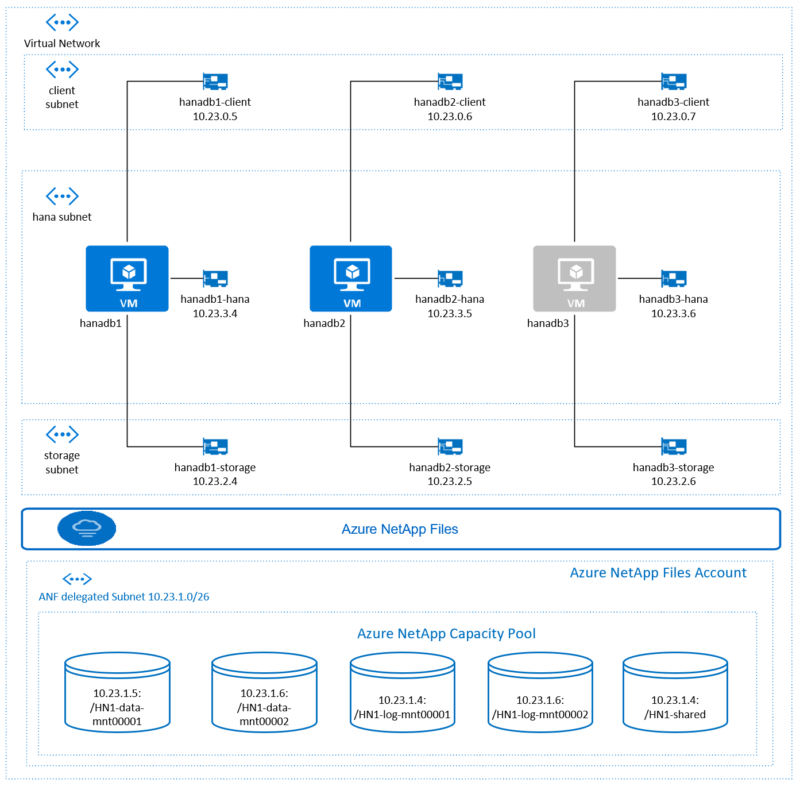

# HANA Scale-Out on Azure with ARM Depoloyment
The template currently deploys three HANA Virtual machines with one managed disk attached.

## **Deployment options and Supported operating systems**

You can use the scripts to deploy environments for both development, test, quality assurance and production workloads.
- Suse
- RedHat

### **Architectural Diagram**

## **Deploy on Azure**
