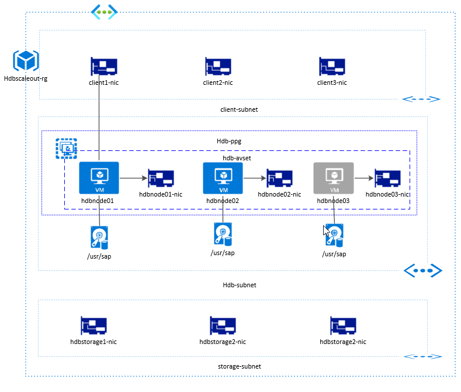

# HANA Scale-Out on Azure with ARM Depoloyment
The template currently deploys three HANA Virtual machines with one managed disk attached.

## **Deployment options and Supported operating systems**

You can use the scripts to deploy environments for both development, test, quality assurance and production workloads.
- Suse
- RedHat

### **Architectural Diagram**

## **Deploy on Azure**

#### **network.json**

This is the template for the VNET, Subnet and Network Security Group deployment.

#### **anfdeploy.json**

This is the template for ANF deployment.

#### **infrastructure.json**
This is the template for the compute abd storage deployment.

